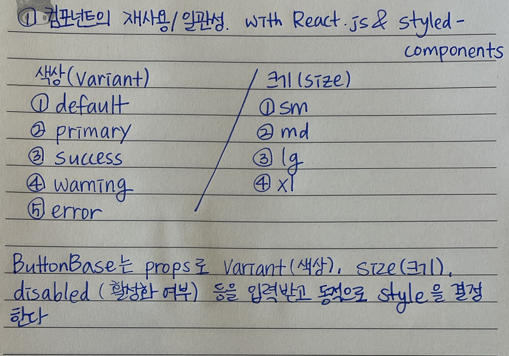
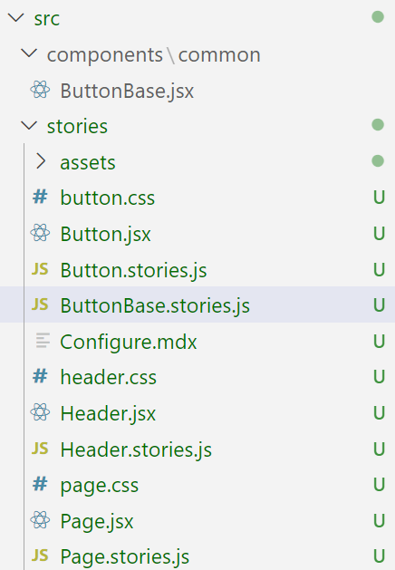

# 🔎재사용 가능한 & 일관성 있는 컴포넌트 만들기

버튼 컴포넌트를 재사용 가능하게 + 일관성 있게 만들어보자.

## 1. 목표/요구사항

1. **버튼의 shape은 항상 동일해야 한다.**

버튼의 전체적인 모양은 변하지 않아야 한다. 즉, 어떤 크기를 갖든, 어떤 색을 갖던지 간에 border-radius, padding 값에 대한 속성들은 고정되어 있어야 한다.

2. **variant props을 통해 preset된 색상을 선택할 수 있어야 한다.**

일관성 있는 디자인을 구현하기 위해 제한적으로 props를 통해 정의된 스타일을 적용할 수 있도록 만든다.

미리 정의된 색을 variant라는 props을 이용하여 선택할 수 있도록 만든다.

3. **size props를 통해 preset된 크기를 선택할 수 있어야 한다.**

색상과 마찬가지로 size 역시 일관성 있는 디자인을 구현하기 위해, 미리 정의된 스타일을 size라는 props을 이용하여 선택할 수 있도록 한다.

4. **버튼 hover, active, disabled에 대한 각각의 스타일이 존재하며, 사용자가 버튼을 클릭했을 때 클릭하는 느낌이 들어야 한다. disabled 되었을 때는 disabled 되었다는 느낌이 들어야 한다.**

따라서 variant에 맞도록 적절한 색상을 :hover, :active, :diabled 등 다양한 경우에 맞게 배치해야 한다.

재사용성을 높이기 위해서는 해당 컴포넌트가 도메인에 얽히지 않아야 하며, props, attributes의 이름들이 일반적이어야 한다.

## 2. 코드로 이해

React.js + styled-components를 이용해서 만들어보았다.



\*전체 ButtonBase 코드

```jsx
import React from "react";
import styled, { css } from "styled-components";
import { get500Color, get600Color, get700Color, get300Color } from "../../utils/color";
import { DEFAULT_FONT_SIZES } from "../../utils/font";

// 버튼 스타일 정의
const buttonRoleStyle = css`
  ${({ variant = "default", disabled }) => css`
    background-color: ${get500Color(variant)};
    color: ${get500Color()};

    &:hover {
      background-color: ${get600Color(variant)};
    }

    &:active {
      background-color: ${get700Color(variant)};
    }

    &:disabled {
      background-color: ${get300Color(variant)};
      pointer-events: none;
      cursor: ${disabled ? "default" : "pointer"};
    }
  `}
`;

const sizeStyle = css`
  ${({ size = "md" }) => {
    if (size === "sm") {
      return css`
        padding: 8px 10px;
        font-size: ${DEFAULT_FONT_SIZES.b2}px;
      `;
    }

    if (size === "lg") {
      return css`
        padding: 12px 48px;
        font-size: ${DEFAULT_FONT_SIZES.b2}px;
      `;
    }

    if (size === "xl") {
      return css`
        padding: 12px 60px;
        font-size: ${DEFAULT_FONT_SIZES.b1}px;
      `;
    }

    // 기본적으로 'md'일 때의 스타일 (default)
    return css`
      padding: 10px 12px;
      font-size: ${DEFAULT_FONT_SIZES.b2}px;
    `;
  }}
`;

const ButtonBase = styled.button`
  display: inline-flex;
  gap: 4px;
  justify-content: center;
  align-items: center;
  vertical-align: center;
  position: relative;
  min-width: 64px;
  border: none;
  border-radius: 6px;
  padding: 10px 12px;
  cursor: pointer;

  line-height: 1.2;
  white-space: nowrap;
  overflow: hidden;
  text-overflow: ellipsis;

  /* button의 Content를 선택할 수 없도록 한다.*/
  user-select: none;

  transition: background-color 0.1s ease;

  /* 배경색 스타일 적용 */
  ${buttonRoleStyle}
  /* 사이즈 스타일 적용 */
    ${sizeStyle}
`;

function Button(props) {
  return (
    <div>
      <ButtonBase variant={props.variant} size={props.size} disabled={props.disabled}>
        {props.label}
      </ButtonBase>
    </div>
  );
}

export default Button;
```

⇒다음과 같이 사용

```jsx
import Button from "./components/common/ButtonBase";

function App() {
  return (
    <div>
      <Button label="기본버튼" variant="primary" size="lg"></Button>
      <Button label="에러버튼" variant="error"></Button>
      <Button label="비활성화버튼" variant="warning" disabled="disabled"></Button>
    </div>
  );
}

export default App;
```

## 3. Storybook

Storybook이란 UI 컴포넌트를 독립적으로 개발할 수 있게 하는 도구이다.

### 🔧React에 Storybook 적용방법

**1단계: Storybook 설치**

React 프로젝트의 루트 디렉터리에서 아래 명령어를 실행하여 Storybook을 설치한다.

```bash
npm install -g @storybook/cli
getstorybook -V //버전 확인
getstorybook init
```

**2단계: 스크립트 설정**

`package.json` 파일을 열고, 다음과 같이 `scripts` 섹션에 Storybook을 시작할 수 있는 스크립트를 추가한다.

```json
"scripts": {
    "storybook": "start-storybook -p 6006",
    "build-storybook": "build-storybook"
}
```

**3단계: Storybook 구성하기**

`.storybook` 폴더 안에 `main.js` 파일을 통해 Storybook을 구성할 수 있다. 이 파일에서 프로젝트의 스토리 파일들을 찾을 수 있는 경로를 설정한다.

```jsx
javascript코드 복사
module.exports = {
  stories: ['../src/**/*.stories.mdx', '../src/**/*.stories.@(js|jsx|ts|tsx)'],
  addons: ['@storybook/addon-links', '@storybook/addon-essentials', '@storybook/addon-interactions'],
};

```

**4단계: 스토리 작성하기**

컴포넌트 별로 스토리 파일을 작성한다. 예를 들어, `Button` 컴포넌트에 대한 스토리를 작성하려면 `ButtonBase.stories.jsx` 파일을 생성하고 다음과 같이 코드를 작성한다.

위치는 다음과 같다.



```jsx
// src/ButtonBase.stories.js

import React from "react";
import Button from "../components/common/ButtonBase";

export default {
  title: "Components/Button",
  component: Button,
  argTypes: {
    variant: {
      control: {
        type: "select",
        options: ["default", "primary", "secondary"], // variant 옵션에 맞게 수정
      },
    },
    size: {
      control: {
        type: "select",
        options: ["sm", "md", "lg", "xl"],
      },
    },
    disabled: {
      control: "boolean",
    },
    label: {
      control: "text",
    },
  },
};

const Template = (args) => <Button {...args} />;

export const Default = Template.bind({});
Default.args = {
  variant: "default",
  size: "md",
  disabled: false,
  label: "Button",
};

export const Primary = Template.bind({});
Primary.args = {
  variant: "primary",
  size: "md",
  disabled: false,
  label: "Primary Button",
};

export const Large = Template.bind({});
Large.args = {
  variant: "error",
  size: "lg",
  disabled: false,
  label: "Large ERROR Button",
};

export const Disabled = Template.bind({});
Disabled.args = {
  variant: "default",
  size: "md",
  disabled: true,
  label: "Disabled Button",
};
```

\*Storybook 문법은 다음과 같다.

**1) export default 객체**

: Stroybook에서의 컴포넌트 설정을 의

- title: Storybook 사이드바에서 컴포넌트가 어떻게 표시될지 정의
- component: 어떤 컴포넌트를 문서화할지 지정
- argTypes
  ```jsx
  variant: {
      control: {
        type: "select",
        options: ["default", "primary", "secondary"], // variant 옵션에 맞게 수정
      },
  },
  ```
  선택할 수 있는 옵션들을 “select” 컨트롤로 제공
  ```jsx
  disabled: {
    control: "boolean",
  },
  label: {
    control: "text",
  },
  ```
  boolean/text 타입으로 표시

**2) Template 함수**

: 실제로 컴포넌트를 렌더링할 때 사용할 템플릿 함수

```jsx
const Template = (args) => <Button {...args} />;
```

**3) Story 정의**

: `Template.bind({})`를 통해 기본 템플릿 함수를 복제하고, 각 스토리별로 초기 상태를 설정한다.

- `Default`, `Primary`, `Large`, `Disabled` 등 각각의 스토리는 다른 `args` 값을 가집니다.
  ```jsx
  export const Primary = Template.bind({});
  Primary.args = {
    variant: "primary",
    size: "md",
    disabled: false,
    label: "Primary Button",
  };
  ```

**5단계: Storybook 실행하기**

모든 설정을 마친 후, 아래 명령어로 Storybook을 실행할 수 있다.

```bash
npm run storybook
```

이 명령어를 실행하면 브라우저에서 Storybook이 시작되며, 구성한 스토리들을 볼 수 있다.

## 참고

[[React] 재사용 가능한 컴포넌트 만들어 사용하기](https://choyeon-dev.tistory.com/16)

[재사용 가능한 버튼 컴포넌트 만들기 - React](https://velog.io/@mrbartrns/재사용-가능한-버튼-컴포넌트-만들기-React)

[React StoryBook의 기초(스토리 작성 / 스토리북 실행)](https://freez2385.github.io/posts/react-storybook/)
